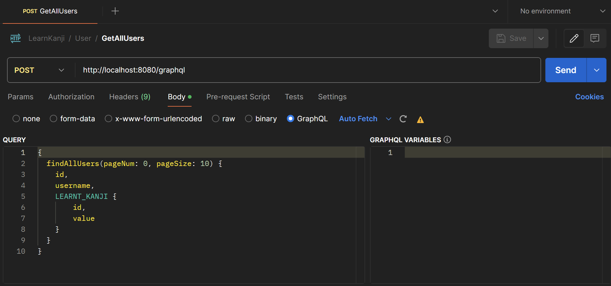

# API Learning Kanji

## Description
This API is a learning tool for kanji. It allows users to create an account, add kanji to their list, and recommend the vocabulary that uses the kanji. The API also provides a list of all the kanji in the database.

## Pre-requisites
To run this project locally, you will need the following installed on your machine:
- [Docker Desktop](https://www.docker.com/products/docker-desktop) on Windows
- [Docker](https://docs.docker.com/get-docker/) on Linux

## Installation
1. Clone the repository
2. Run `docker compose up -d` in the root directory of the project 
- The API will be available at `http://localhost:8080`
- The GraphiQL interface will be available at `http://localhost:8080/graphiql`
- The Neo4j Browser will be available at `http://localhost:7474`

3. To stop the containers, run `docker compose down` in the root directory of the project

## API Documentation
Here is the image of an API call example:

All API calls are made to the `/graphql` endpoint with HTTP POST method. The API supports the following queries and mutations:

### Queries
- `findUserByUsername(username: String!)`: Find a user by their username
- `findAllUsers(pageNum: Int!, pageSize: Int!)`: Find all users
- `findKanjiByValue(value: String!)`: Find a kanji by its value

### Mutations
- `createUser(username: String!, jlpt: Int)`: Create a new user
- `createKanji(value: String!, stroke: Int, grade: Int, frequency: Int, jlpt: Int, meaning: [String]!, readings_on: [String], readings_kun: [String])`: Create a new kanji
- `userLearntKanji(username: String!, kanji: String!)`: Add a kanji to a user's list of learnt kanji

For more detailed information on the GraphQL schema, please find the `schema.graphqls` file in this directory of the project `./src/main/resources/graphql/`.